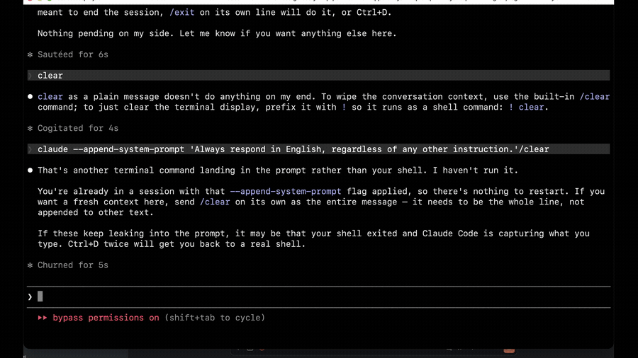

# crier

[](https://github.com/pg-Parunson/crier/actions/workflows/ci.yml)
[](https://github.com/pg-Parunson/crier/releases)
[](LICENSE)

**Your coding agent tells you when it's done — out loud, in one sentence.**

*[한국어](README.ko.md)*

<p align="center">
  
</p>
<p align="center">
  <sub><a href="docs/demo.mp4">▶ with sound</a> — the chime and the voice are the whole point.</sub>
</p>

You set the agent going and switch to something else. It finishes. You don't notice. Five minutes later you tab back, read the screen, and find out it just needed you to say yes.

crier says it instead:

> 🔔 *"Fixed the memory leak, all three tests pass. Want me to commit?"*
>
> 🔔 *"Delete the build folder — may I?"*
>
> 🔔 *"You've hit the rate limit."*

Not a notification sound — **a sentence you can act on without looking.**

Runs entirely on your machine. No API key, no account, no per-character billing. Korean, English, Japanese.

---

## Install

```bash
curl -fsSL https://raw.githubusercontent.com/pg-Parunson/crier/main/bootstrap.sh | sh
```

Then **restart your agent** and run `crier demo` to hear it.

That's it. Nothing to configure, no keys to paste. (Not on Claude Code? Add `-s -- codex`, `-s -- gemini`, or `-s -- cursor` to the end.)

macOS. Changed your mind? `crier uninstall` puts your settings back.

## Make it yours (three minutes, then never again)

```bash
crier voices             # plays all ten, one after another
crier voice F2           # keep the one you liked
crier name "Sam"         # it'll use your name now and then — not every time
crier tone friendly      # plain · friendly · playful
```

Then **go back to working normally.** crier sits in the background and speaks up on its own.

## When it speaks

Four moments. Everything else, it stays quiet.

| | |
|---|---|
| **It finished** | *"All three tests pass. Want me to commit?"* |
| **It needs permission** | *"Delete the build folder — may I?"* |
| **It broke** | *"You've hit the rate limit."* |
| **It's been waiting** | *"Still here whenever you're ready."* |

It never reads the answer aloud. That's already on your screen, and you read faster than you listen.

**Start typing and it stops mid-word.** You never have to wait for it to finish a sentence.

## No sound?

```bash
crier doctor
```

It checks every link in the chain — config, daemon, model, audio player, hooks, the
`[say]` instruction, the mute flag — and tells you which one is broken, with the fix
next to it. Three most common answers: you haven't restarted your agent session since
installing; you're muted (`crier unmute`); the daemon isn't up (`crier start`).
Real failures are also logged to `~/.crier/.venv/crier.log`.

## Too chatty?

```bash
crier tone plain         # fewer words
crier uninstall          # gone; settings restored from backup
```

To silence one kind of announcement, flip it to `false` under `events` in `~/.crier/config.json`. Saves take effect immediately — no restart.

---

<details>
<summary><b>How it works</b> — the design, and why it's built this way</summary>

### What gets spoken, and what doesn't

[peon-ping](https://github.com/PeonPing/peon-ping) (4.9k★) proved the trigger model is right: hook the agent's lifecycle, make a noise. But a fixed sound only tells you *something* happened, never *what* — so you still go look. crier puts a sentence where the sound was.

Every candidate announcement faces one question: **does hearing this change what you do?**

| Event | Changes what you do? |
|---|---|
| Turn finished | ✅ come back and check |
| Permission needed | ✅ approve or don't |
| Request failed | ✅ wait, or go do something else |
| Idle too long | ✅ come back |
| ~~Subagent started~~ | ❌ **off by default** |

That last row is the whole design in miniature. You just pressed enter — being told "starting work" changes nothing. No rewording fixes that, because the wording isn't the problem: **the event has no content.**

### Who writes the sentence

The agent does. crier asks it to end each reply with one spoken line:

```
[say] Fixed the memory leak, all three tests pass. Want me to commit?
```

**There is no second API call and no second key.** The model that just did the work — the only thing that knows what the turn was about — writes one more line. A few output tokens. If you're running a coding agent, you already have everything crier needs.

Skip that (`crier prompt remove`) and it falls back to a rule: the last sentence if it's a question — that's what you have to answer — otherwise the first, where the outcome gets stated. It works. The agent writes a better line than any rule can.

**Permission requests borrow the model's words too.** Agents already write a plain-language `description` next to every shell command — "Delete the build folder" beside `rm -rf build`. crier speaks that, so you hear *"Delete the build folder — may I?"* rather than *"May I run rm?"*. Free again: the sentence was already there.

What genuinely is canned: **errors** (`error_type` is a closed enum — ten values, each with one correct rendering, so a table is the right answer, not a limitation) and **idle** (there is nothing to say). Both live in [`locales.json`](locales.json). The tone you pick goes into those lines **and** into the agent's instruction, which is why a persona costs nothing here — it's a sentence in a prompt, not a model.

### Noise control

This is the part that decides whether you keep it installed. A parallel fan-out fires a hook *per subagent*; run ten projects at once and a naive build becomes an attack.

1. **Once per turn.** Subagent announcements fire only for the turn's first agent (keyed on `prompt_id`). Eight agents or thirty — you hear it once, then silence until your next prompt. A cooldown alone can't do this: a heavy turn keeps spawning agents for minutes, so it would only flatten the opening burst.
2. **Cooldown** (2.5s, shared across sessions) so ten projects don't talk over each other.
3. **Priority.** Permission requests and errors **skip the cooldown.** A chatty announcement must never swallow *"Drop the users table — may I?"*.

### The chime

A voice out of nowhere makes you jump, so a bell rings first.

The chimes are **synthesized at install** ([`bin/earcons.py`](bin/earcons.py)), never shipped as files — nothing to license, nothing to attribute. Each is a few harmonic partials under an exponential decay: a struck bell. **Rising** asks or announces; **falling** settles or warns. All under half a second.

They pay for themselves twice: **the speech is synthesized while the chime rings**, so the words land as it fades and you never hear the model think.

The first version sat around C6–G6, which put its second harmonic near 3 kHz — right where hearing is sharpest — and it hurt. The default now sits an octave lower and fades in over 25ms, so the note arrives rather than hits. `crier chimes bell` brings the bright ones back.

### Why hooks, not MCP

- **A hook needs no cooperation from the model.** An MCP tool only runs if the model *decides* to call it — so the moment it thinks "task's done," your voice loop dies silently.
- Hooks live in the agent's settings file, which the **terminal and the IDE extension share.** VS Code's Claude extension can't even discover MCP servers.
- The hook returns in ~50ms and hands playback to a detached child. Your turn never waits for a sentence to finish.
- It writes nothing to stdout, so it **cannot influence the agent's control flow.** If crier breaks, your session doesn't.

### The voice

[Supertonic](https://github.com/supertone-inc/supertonic) — a local ONNX model. No GPU, no network. Ten voices, 31 languages.

**Korean actually works**, which is worth stating because most open TTS silently doesn't. Kokoro-82M has no Korean at all — its maintainer dropped it. Chatterbox Multilingual reports 70.9% CER on Korean, a number Resemble AI publishes themselves. Piper has no `ko_KR` voice. XTTS-v2 speaks Korean under a non-commercial license from a company that shut down in 2024, so it can never be relicensed. Supertonic is the one that reads `useEffect` as *"useEffect"* inside a Korean sentence, instead of transliterating it into something unrecognizable.

Measured on an M-series Mac: RTF **0.159** — a 5-second sentence takes ~0.8s to synthesize. (Supertonic's marketing claims 0.012; that did not reproduce here.) Fast enough, because the chime covers it.

### Agents

| Agent | Turn end + text | Permission + which command |
|---|---|---|
| **Claude Code** | ✅ | ✅ |
| **Codex CLI** | ✅ | ✅ |
| **Gemini CLI** | ✅ | ✅ |
| **Cursor** | ✅ | ✅ |

Claude Code and Codex use identical event names and payloads, so they share a hook. Gemini and Cursor say the same things in different words — [`announce.py`](bin/announce.py) normalizes them. Adding an agent is a routing-table entry in [`bin/wire.py`](bin/wire.py), not an integration.

Agents that expose only a contentless ping (Aider) can't carry a brief. crier is the wrong tool there; use peon-ping.

### Config

`~/.crier/config.json` — re-read on every event, so edits apply immediately.

| | |
|---|---|
| `lang` `tone` `voice` `call_name` `name_chance` | who it is |
| `events.*` | what it speaks |
| `cooldown_sec` `max_chars` | how much |
| `earcons.enabled` `gap_ms` | the bell |
| `marker` | the prefix the agent writes its spoken line behind |

</details>

## Contributing

[CONTRIBUTING.md](CONTRIBUTING.md) — the one-question philosophy, how to add a language
(the TTS engine speaks 31; crier ships 3), and how to add an agent. What crier can see
and what it modifies is spelled out in [SECURITY.md](SECURITY.md).

## License

MIT.

Supertonic's **code** is MIT; its **model weights are OpenRAIL-M**, which carries use restrictions. crier never vendors them — they're fetched to your cache on first run, so that license lands on you directly rather than riding in on a clone.
